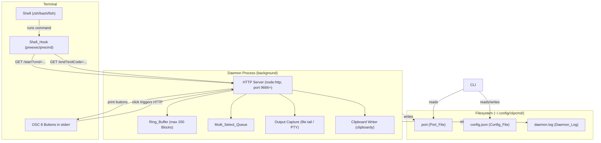

# Design Document: clipcmd

## Overview

`clipcmd` is a production-ready NPM CLI package that injects clickable OSC 8 "Copy" buttons into the terminal after every shell command. It operates as a two-process system: a persistent background **Daemon** (HTTP server on port 9666+) and a **CLI** binary that manages the daemon, installs shell hooks, and provides user-facing commands.

When a shell command executes, lightweight shell hooks send HTTP signals to the Daemon. The Daemon records the command and its output into a fixed-size Ring Buffer, then prints OSC 8 hyperlinks to the terminal. Clicking a link triggers an HTTP request that writes text to the system clipboard via `clipboardy`.

The package is written in TypeScript, targeting Node.js ≥ 18, and is published to NPM. It supports Zsh, Bash, and Fish shells, and runs on macOS, Linux, and Windows.

---

## Architecture



### Process Model

| Process | Entry Point | Lifetime |
|---|---|---|
| CLI | `bin/clipcmd.js` | Short-lived (per command) |
| Daemon | `dist/daemon/index.js` | Long-lived (background, detached) |

The CLI forks the Daemon with `child_process.spawn(..., { detached: true, stdio: 'ignore' })` and calls `child.unref()` so the CLI exits immediately. The Daemon writes its PID and port to the Port_File for CLI discovery.

---

## Components and Interfaces

### 1. CLI (`src/cli/index.ts`)

Entry point for the `clipcmd` binary. Parses commands and delegates to sub-modules.

```typescript
interface CliCommand {
  name: 'start' | 'stop' | 'status' | 'init' | 'uninstall' | 'shell';
  run(args: string[]): Promise<void>;
}
```

**Commands:**
- `start` — forks Daemon, writes PID/port
- `stop` — reads Port_File, sends `/shutdown` to Daemon
- `status` — reads Port_File, reports daemon state
- `init` — detects shell, installs hooks
- `uninstall` — removes hooks from shell config
- `shell` — spawns PTY wrapper (Phase 2)

### 2. Daemon HTTP Server (`src/daemon/server.ts`)

Implemented using only `node:http`. Single-file HTTP request handler that routes GET requests to registered handlers.

```typescript
interface DaemonServer {
  start(): Promise<void>;
  stop(): Promise<void>;
  getPort(): number;
}

type RouteHandler = (
  query: Record<string, string>,
  res: http.ServerResponse
) => Promise<void> | void;
```

**Endpoints:**

| Method | Path | Description |
|---|---|---|
| GET | `/start` | Begin new command Block |
| GET | `/end` | Finalize Block, print buttons |
| GET | `/copy` | Copy cmd or output to clipboard |
| GET | `/select` | Toggle Block in Multi_Select_Queue |
| GET | `/copy-selected` | Batch copy selected Blocks |
| GET | `/health` | Liveness check |
| GET | `/shutdown` | Graceful shutdown |
| `*` | `*` | HTTP 404 |

### 3. Ring Buffer (`src/daemon/ringBuffer.ts`)

Fixed-capacity circular buffer. When full, evicts the oldest Block and also removes it from the Multi_Select_Queue.

```typescript
interface Block {
  id: string;          // UUID v4
  command: string;     // Decoded command string
  pwd: string;         // Working directory
  timestamp: number;   // Unix ms
  exitCode: number | null;
  output: string;      // Raw captured bytes (ANSI preserved)
  inProgress: boolean;
}

interface RingBuffer {
  push(block: Block): Block | null;   // returns evicted Block or null
  get(id: string): Block | undefined;
  getAll(): Block[];
  capacity: number;
  size: number;
}
```

### 4. Output Capture (`src/daemon/capture.ts`)

Phase 1: Tail a temp file written by the shell. The Shell_Hook redirects output via `tee` to `~/.config/clipcmd/output.tmp`. The Daemon reads bytes appended between `/start` and `/end` timestamps.

```typescript
interface CaptureSource {
  startCapture(blockId: string): void;
  endCapture(blockId: string): string; // returns raw output
}
```

Phase 2 (optional): PTY-based capture via `node-pty`.

### 5. Shell Detector (`src/installer/shellDetector.ts`)

```typescript
type SupportedShell = 'zsh' | 'bash' | 'fish';

interface ShellDetector {
  detect(): SupportedShell;  // throws UnsupportedShellError if not recognized
}
```

Reads `process.env.SHELL`, extracts the basename, and matches against known shells.

### 6. Installer (`src/installer/installer.ts`)

Reads the target config file, inserts/replaces the hook block between marker comments.

```typescript
interface Installer {
  install(shell: SupportedShell): void;
  uninstall(shell: SupportedShell): void;
  isInstalled(shell: SupportedShell): boolean;
}

const HOOK_START_MARKER = '# === CLIPCMD HOOK START ===';
const HOOK_END_MARKER   = '# === CLIPCMD HOOK END ===';
```

### 7. Config Manager (`src/config/config.ts`)

```typescript
interface ClipCmdConfig {
  port: number;          // default: 9666
  ringBufferSize: number; // default: 200
}

interface ConfigManager {
  load(): ClipCmdConfig;
  save(config: ClipCmdConfig): void;
}
```

Falls back to built-in defaults when the file is missing or cannot be parsed.

### 8. Clipboard Writer (`src/daemon/clipboard.ts`)

Thin wrapper around `clipboardy`. Catches platform errors and re-throws as `ClipboardError`.

```typescript
interface ClipboardWriter {
  write(text: string): Promise<void>;
}
```

### 9. OSC 8 Emitter (`src/daemon/osc8.ts`)

Builds and prints OSC 8 button sequences to `process.stderr`.

```typescript
function buildOsc8Button(label: string, url: string): string;
function printButtons(block: Block, port: number): void;
```

Format: `\x1b]8;;{url}\x07{label}\x1b]8;;\x07`

### 10. Shell Hooks (`hooks/`)

Static text files containing per-shell hook snippets. The Installer reads these files and embeds them in the user's shell config.

| File | Shell |
|---|---|
| `hooks/zsh.sh` | Zsh (`preexec` / `precmd`) |
| `hooks/bash.sh` | Bash (`DEBUG` trap / `PROMPT_COMMAND`) |
| `hooks/fish.fish` | Fish (`fish_preexec` / `fish_postexec`) |

Each hook reads the port from the Port_File and silently no-ops if the Daemon is unreachable.

---

## Data Models

### Block

```typescript
interface Block {
  id: string;          // UUID v4, e.g. "a1b2c3d4-..."
  command: string;     // Raw decoded command string
  pwd: string;         // Absolute working directory path
  timestamp: number;   // Date.now() at /start receipt
  exitCode: number | null; // null while in-progress
  output: string;      // Raw captured text, ANSI preserved, no mutation
  inProgress: boolean; // true between /start and /end
}
```

### ClipCmdConfig

```typescript
interface ClipCmdConfig {
  port: number;          // Preferred starting port (default: 9666)
  ringBufferSize: number; // Max blocks in Ring_Buffer (default: 200)
}
```

### Multi_Select_Queue

```typescript
type MultiSelectQueue = string[]; // ordered list of Block IDs
```

### Port_File

Plain text file at `~/.config/clipcmd/port` containing a single integer (the active port). Written atomically on Daemon startup; deleted on clean shutdown.

### Daemon State (in-memory)

```typescript
interface DaemonState {
  server: http.Server;
  port: number;
  ringBuffer: RingBuffer;
  multiSelectQueue: MultiSelectQueue;
  currentBlockId: string | null; // ID of in-progress Block
  capture: CaptureSource;
}
```

---

## Correctness Properties

*A property is a characteristic or behavior that should hold true across all valid executions of a system — essentially, a formal statement about what the system should do. Properties serve as the bridge between human-readable specifications and machine-verifiable correctness guarantees.*

### Property 1: Ring Buffer capacity invariant

*For any* sequence of Blocks pushed into the Ring_Buffer, the size of the buffer SHALL never exceed its configured capacity.

**Validates: Requirements 3.5**

### Property 2: Ring Buffer FIFO eviction

*For any* Ring_Buffer at full capacity, pushing a new Block SHALL cause the oldest Block (the one pushed earliest) to be evicted, and the new Block to be the most-recently-added entry.

**Validates: Requirements 3.5**

### Property 3: Multi_Select_Queue toggle idempotence

*For any* Block ID, selecting it twice (toggling on then off) SHALL leave the Multi_Select_Queue in the same state as before either selection.

**Validates: Requirements 6.1, 6.2**

### Property 4: Multi_Select_Queue uniqueness invariant

*For any* sequence of `/select` requests with arbitrary Block IDs (including duplicates), the Multi_Select_Queue SHALL contain each Block ID at most once.

**Validates: Requirements 6.1, 6.2**

### Property 5: Multi-select batch copy format

*For any* non-empty Multi_Select_Queue, the text written to the Clipboard by `/copy-selected` SHALL equal the concatenation of `$ {command}\n{output}\n\n` for each Block in chronological (insertion) order, with no additional prefix, suffix, or decoration.

**Validates: Requirements 6.3, 7.5**

### Property 6: Copy does not mutate output

*For any* Block, the string written to the Clipboard by `/copy?type=output` SHALL be byte-for-byte identical to the Block's `output` field — including all ANSI sequences, whitespace, tabs, and newlines.

**Validates: Requirements 5.7, 7.1, 7.2**

### Property 7: Hook idempotent installation

*For any* shell config file, running the Installer's `install` operation twice SHALL produce a file that contains the CLIPCMD hook block exactly once (same result as running it once).

**Validates: Requirements 2.5**

### Property 8: Hook clean uninstall

*For any* shell config file that contains a CLIPCMD hook block, running `uninstall` SHALL produce a file that contains neither the `CLIPCMD HOOK START` marker nor the `CLIPCMD HOOK END` marker, and all content outside the hook block SHALL be preserved exactly.

**Validates: Requirements 2.9**

### Property 9: Config round-trip

*For any* valid `ClipCmdConfig` object, serializing it to JSON and deserializing it SHALL produce an equivalent object.

**Validates: Requirements 8.3**

### Property 10: Evicted Block removed from Multi_Select_Queue

*For any* Ring_Buffer at full capacity, when a Block is evicted by pushing a new Block, that evicted Block's ID SHALL no longer appear in the Multi_Select_Queue.

**Validates: Requirements 6.6**

### Property 11: OSC 8 button format correctness

*For any* Block and port number, the OSC 8 button string produced by `buildOsc8Button` SHALL match the pattern `\x1b]8;;{url}\x07{label}\x1b]8;;\x07` exactly, where `{url}` and `{label}` appear literally in the correct positions.

**Validates: Requirements 5.2**

---

## Error Handling

### Daemon Not Running

- Shell_Hook detects missing Port_File or failed HTTP request → silently no-ops (no stderr output, no blocking).
- CLI `stop`/`status` reads missing Port_File → prints user-friendly "Daemon is not running" message and exits 0.

### Port Conflict

- Daemon iterates ports 9666, 9667, … until `listen` succeeds. Tries up to 10 ports before giving up with a fatal error logged to Daemon_Log.

### Corrupt Config

- `ConfigManager.load()` wraps `JSON.parse` in try/catch. On any error, returns `DEFAULT_CONFIG`. Never throws to the caller.

### Unknown Block ID

- `/copy` with unknown `id` → HTTP 404, nothing written to clipboard.
- `/select` with unknown `id` → HTTP 404, queue unchanged.

### Clipboard Failure

- `clipboardy` write failure → log to Daemon_Log, respond HTTP 500 with plain-text error.

### Unsupported Shell

- `ShellDetector.detect()` throws `UnsupportedShellError` → CLI catches, prints supported shells list, exits 1.

### Malformed Query Parameters

- Any endpoint receives unexpected/missing query params → HTTP 400 with plain-text description.

### SIGTERM Handling

- Daemon registers `process.on('SIGTERM', ...)` → closes HTTP server → deletes Port_File → calls `process.exit(0)`.

---

## Testing Strategy

### Approach

The project uses a **dual testing approach**:
- **Unit tests** — specific examples, edge cases, error conditions for each module
- **Property-based tests** — universal correctness properties across arbitrary inputs

**Property-based testing library:** [`fast-check`](https://github.com/dubzzz/fast-check) (TypeScript-native, actively maintained, no additional system dependencies).

Each property test runs a minimum of **100 iterations** (fast-check default). Each test is annotated with a comment referencing the design property it validates:

```typescript
// Feature: clipcmd, Property N: <property title>
```

### Unit Tests

Focus areas:
- `RingBuffer`: push, get, capacity enforcement, FIFO eviction order
- `Installer`: idempotent install, clean uninstall, content preservation
- `ConfigManager`: missing file → defaults, corrupt JSON → defaults, save/load round-trip
- `ShellDetector`: each supported shell, unsupported shell error
- `Osc8Emitter`: button format string correctness
- HTTP endpoints: each route returns correct status codes, 404 for unknown routes, 400 for bad params
- Multi_Select_Queue: toggle, uniqueness, eviction cleanup

### Property-Based Tests

| Property | Module Under Test | Generator |
|---|---|---|
| P1: Ring Buffer capacity invariant | `RingBuffer` | Arbitrary arrays of Blocks (length 0–500) |
| P2: Ring Buffer FIFO eviction | `RingBuffer` | Sequences of pushes beyond capacity |
| P3: Multi_Select_Queue toggle idempotence | Daemon state | Arbitrary Block IDs |
| P4: Multi_Select_Queue uniqueness | Daemon state | Arbitrary sequences of select requests |
| P5: Multi-select batch copy format | Daemon `/copy-selected` | Arbitrary Block arrays |
| P6: Copy does not mutate output | Daemon `/copy` | Arbitrary strings (incl. ANSI, unicode, whitespace) |
| P7: Hook idempotent installation | `Installer` | Arbitrary shell config file contents |
| P8: Hook clean uninstall | `Installer` | Arbitrary shell config files with hook present |
| P9: Config round-trip | `ConfigManager` | Arbitrary `ClipCmdConfig` objects |
| P10: Evicted Block removed from queue | `RingBuffer` + `MultiSelectQueue` | Sequences of push + select |
| P11: OSC 8 button format | `buildOsc8Button` | Arbitrary labels and URLs |

### Test Framework Setup

- **Test runner:** Vitest (TypeScript-native, fast, compatible with Node 18+)
- **PBT library:** `fast-check`
- **Location:** `src/**/__tests__/*.test.ts`
- **Config:** `vitest.config.ts` at root
- **Run command:** `npm test` → `vitest --run`
