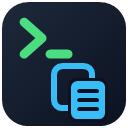

<p align="center">
  
</p>

<h1 align="center">clipcmd</h1>

<p align="center">
  Copy buttons after every terminal command: the command, its output, or both — in one click.
</p>

<p align="center">
  <a href="https://github.com/Djain912/clipcmd/actions/workflows/ci.yml"></a>
  <a href="https://www.npmjs.com/package/clipcmd"></a>
  <a href="https://marketplace.visualstudio.com/items?itemName=djain912.clipcmd"></a>
  <a href="LICENSE"></a>
</p>

```
$ npm test
  ✓ 42 tests passed
[COPY CMD] [COPY OUTPUT] [COPY BOTH] [+]
```

Every developer has copied a command and its output into an issue, a chat or a doc by dragging the mouse over the terminal. clipcmd puts clickable buttons under every command instead:

- **`[COPY CMD]`** — the command line
- **`[COPY OUTPUT]`** — what it printed, as clean plain text (no colors, progress bars at their final state, wrapped lines joined)
- **`[COPY BOTH]`** — `$ command` and its output, ready to paste
- **`[+]`** — collect several commands and their output into one clipboard entry

Works in **PowerShell** (5.1 and 7), **bash** (including Git Bash), **zsh** and **fish** on **Windows, macOS and Linux** — in Windows Terminal, VS Code, iTerm2, GNOME Terminal, WezTerm, kitty and any other terminal with [OSC 8 hyperlinks](https://gist.github.com/egmontkob/eb114294efbcd5adb1944c9f3cb5feda).

## Install

```bash
npm install -g clipcmd
clipcmd init
```

Open a new terminal and run any command. Using VS Code? Also install the [clipcmd extension](https://marketplace.visualstudio.com/items?itemName=djain912.clipcmd) so `[COPY OUTPUT]` works in its terminal.

Something off? `clipcmd doctor` checks the setup and tells you how to fix it.

## This repository

| Directory | What | Published as |
|---|---|---|
| [`cli/`](cli) | The `clipcmd` command, background daemon and shell hooks — [full documentation](cli/README.md) | [`clipcmd` on npm](https://www.npmjs.com/package/clipcmd) |
| [`vscode-extension/`](vscode-extension) | Output capture and daemon controls for VS Code's terminal | [`djain912.clipcmd` on the VS Code Marketplace](https://marketplace.visualstudio.com/items?itemName=djain912.clipcmd) |

## How it works

A small daemon listens on `127.0.0.1`. A hook in your shell config reports each command and prints the buttons when it finishes. The buttons are `clipcmd://` links handled by a tiny per-user link handler, so a click copies silently — no browser, no window. To know what a command printed, interactive sessions run inside a pseudo-terminal recorder (`clipcmd shell`, automatic), or, in VS Code, the extension reads the output from VS Code's shell integration. Nothing leaves your machine.

Details: [cli/README.md](cli/README.md).

## Contributing

Bug reports and pull requests are welcome — see [CONTRIBUTING.md](CONTRIBUTING.md). Security issues: [SECURITY.md](SECURITY.md).

## License

[MIT](LICENSE) © Djain912
